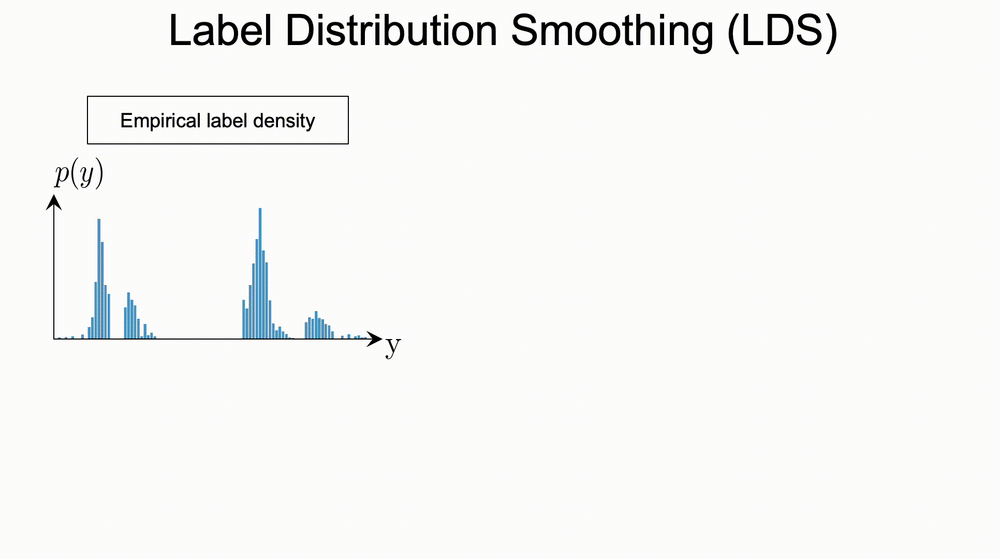
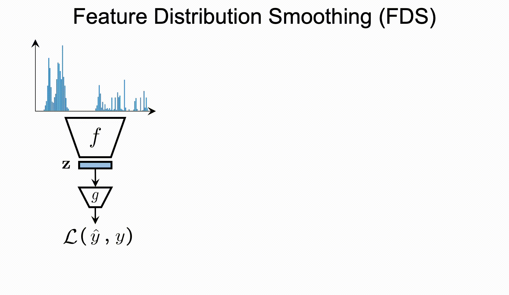
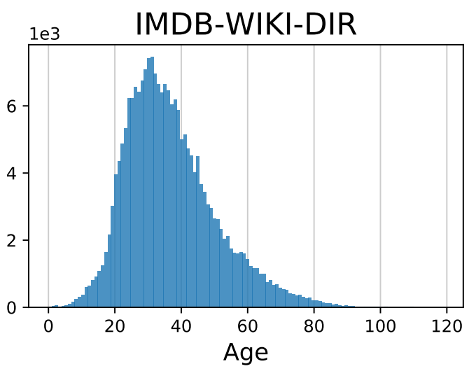
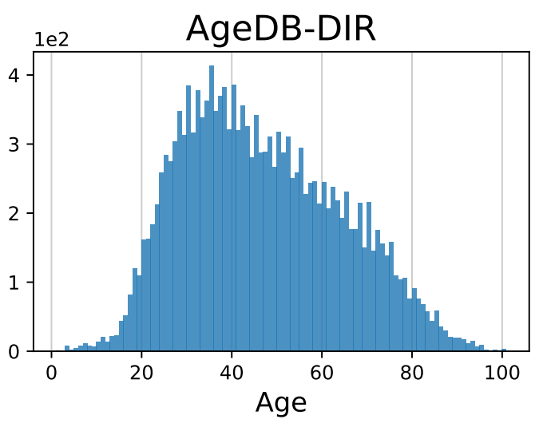
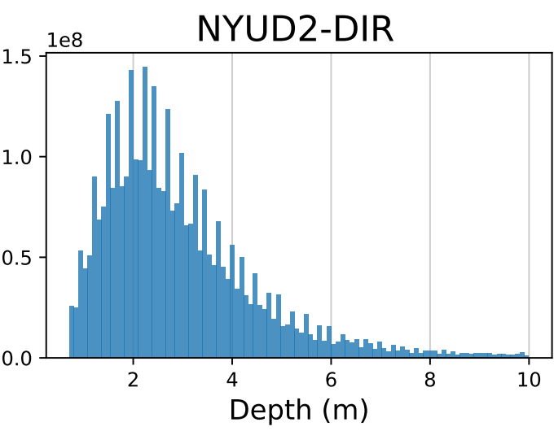
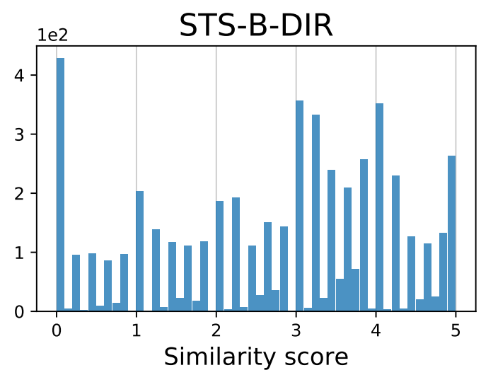
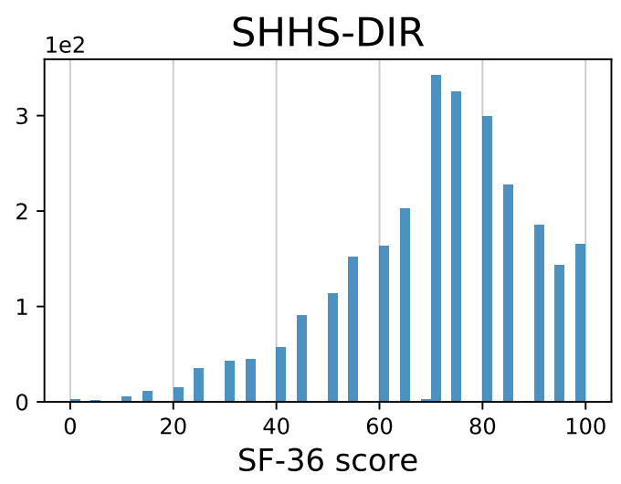

# Delving into Deep Imbalanced Regression

This repository contains the implementation code for paper: <br>
__Delving into Deep Imbalanced Regression__ <br>
[Yuzhe Yang](http://www.mit.edu/~yuzhe/), [Kaiwen Zha](https://kaiwenzha.github.io/), [Ying-Cong Chen](https://yingcong.github.io/), [Hao Wang](http://www.wanghao.in/), [Dina Katabi](https://people.csail.mit.edu/dina/) <br>
_38th International Conference on Machine Learning (ICML 2021), **Long Oral**_ <br>
[[Project Page](http://dir.csail.mit.edu/)] [[Paper](https://arxiv.org/abs/2102.09554)] [[Video](https://youtu.be/grJGixofQRU)] [[Blog Post](https://towardsdatascience.com/strategies-and-tactics-for-regression-on-imbalanced-data-61eeb0921fca)] [](https://colab.research.google.com/github/YyzHarry/imbalanced-regression/blob/master/tutorial/tutorial.ipynb)
___
<p align="center">
     <br>
<b>Deep Imbalanced Regression (DIR)</b> aims to learn from imbalanced data with continuous targets, <br> tackle potential missing data for certain regions, and generalize to the entire target range.
</p>


## Beyond Imbalanced Classification: Brief Introduction for DIR
Existing techniques for learning from imbalanced data focus on targets with __categorical__ indices, i.e., the targets are different classes. However, many real-world tasks involve __continuous__ and even infinite target values. We systematically investigate _Deep Imbalanced Regression (DIR)_, which aims to learn continuous targets from natural imbalanced data, deal with potential missing data for certain target values, and generalize to the entire target range.

We curate and benchmark large-scale DIR datasets for common real-world tasks in _computer vision_, _natural language processing_, and _healthcare_ domains, ranging from single-value prediction such as age, text similarity score, health condition score, to dense-value prediction such as depth.


## Usage
We separate the codebase for different datasets into different subfolders. Please go into the subfolders for more information (e.g., installation, dataset preparation, training, evaluation & models).

#### __[IMDB-WIKI-DIR](https://github.com/YyzHarry/imbalanced-regression/tree/main/imdb-wiki-dir)__ &nbsp;|&nbsp; __[AgeDB-DIR](https://github.com/YyzHarry/imbalanced-regression/tree/main/agedb-dir)__ &nbsp;|&nbsp; __[NYUD2-DIR](https://github.com/YyzHarry/imbalanced-regression/tree/main/nyud2-dir)__ &nbsp;|&nbsp; __[STS-B-DIR](https://github.com/YyzHarry/imbalanced-regression/tree/main/sts-b-dir)__


## Highlights
__(1) :heavy_check_mark: New Task:__ Deep Imbalanced Regression (DIR)

__(2) :heavy_check_mark: New Techniques:__

|  |  |
| :-: | :-: |
| Label distribution smoothing (LDS) | Feature distribution smoothing (FDS) |

__(3) :heavy_check_mark: New Benchmarks:__ <br>
- _Computer Vision:_ :bulb: IMDB-WIKI-DIR (age) / AgeDB-DIR (age) / NYUD2-DIR (depth)
- _Natural Language Processing:_ :clipboard: STS-B-DIR (text similarity score)
- _Healthcare:_ :hospital: SHHS-DIR (health condition score)

| [IMDB-WIKI-DIR](https://github.com/YyzHarry/imbalanced-regression/tree/main/imdb-wiki-dir) | [AgeDB-DIR](https://github.com/YyzHarry/imbalanced-regression/tree/main/agedb-dir) | [NYUD2-DIR](https://github.com/YyzHarry/imbalanced-regression/tree/main/nyud2-dir) | [STS-B-DIR](https://github.com/YyzHarry/imbalanced-regression/tree/main/sts-b-dir) | SHHS-DIR |
| :-: | :-: | :-: | :-: | :-: |
|  |  |  |  |  |


## Apply LDS and FDS on Other Datasets / Models
We provide examples of how to apply LDS and FDS on other customized datasets and/or models.

### LDS
To apply LDS on your customized dataset, you will first need to estimate the effective label distribution: 
```python
from collections import Counter
from scipy.ndimage import convolve1d
from utils import get_lds_kernel_window

# preds, labels: [Ns,], "Ns" is the number of total samples
preds, labels = ..., ...
# assign each label to its corresponding bin (start from 0)
# with your defined get_bin_idx(), return bin_index_per_label: [Ns,] 
bin_index_per_label = [get_bin_idx(label) for label in labels]

# calculate empirical (original) label distribution: [Nb,]
# "Nb" is the number of bins
Nb = max(bin_index_per_label) + 1
num_samples_of_bins = dict(Counter(bin_index_per_label))
emp_label_dist = [num_samples_of_bins.get(i, 0) for i in range(Nb)]

# lds_kernel_window: [ks,], here for example, we use gaussian, ks=5, sigma=2
lds_kernel_window = get_lds_kernel_window(kernel='gaussian', ks=5, sigma=2)
# calculate effective label distribution: [Nb,]
eff_label_dist = convolve1d(np.array(emp_label_dist), weights=lds_kernel_window, mode='constant')
```
With the estimated effective label distribution, one straightforward option is to use the loss re-weighting scheme:
```python
from loss import weighted_mse_loss

# Use re-weighting based on effective label distribution, sample-wise weights: [Ns,]
eff_num_per_label = [eff_label_dist[bin_idx] for bin_idx in bin_index_per_label]
weights = [np.float32(1 / x) for x in eff_num_per_label]

# calculate loss
loss = weighted_mse_loss(preds, labels, weights=weights)
```

### FDS
To apply FDS on your customized data/model, you will first need to define the FDS module in your network:
```python
from fds import FDS

config = dict(feature_dim=..., start_update=0, start_smooth=1, kernel='gaussian', ks=5, sigma=2)

def Network(nn.Module):
    def __init__(self, **config):
        super().__init__()
        self.feature_extractor = ...
        self.regressor = nn.Linear(config['feature_dim'], 1)  # FDS operates before the final regressor
        self.FDS = FDS(**config)

    def forward(self, inputs, labels, epoch):
        features = self.feature_extractor(inputs)  # features: [batch_size, feature_dim]
        # smooth the feature distributions over the target space
        smoothed_features = features    
        if self.training and epoch >= config['start_smooth']:
            smoothed_features = self.FDS.smooth(smoothed_features, labels, epoch)
        preds = self.regressor(smoothed_features)
        
        return {'preds': preds, 'features': features}
```
During training, you will need to update the FDS statistics after each training epoch:
```python
model = Network(**config)

for epoch in range(num_epochs):
    for (inputs, labels) in train_loader:
        # standard training pipeline
        ...

    # update FDS statistics after each training epoch
    if epoch >= config['start_update']:
        # collect features and labels for all training samples
        ...
        # training_features: [num_samples, feature_dim], training_labels: [num_samples,]
        training_features, training_labels = ..., ...
        model.FDS.update_last_epoch_stats(epoch)
        model.FDS.update_running_stats(training_features, training_labels, epoch)
```


## Updates
- [06/2021] We provide a [hands-on tutorial](https://github.com/YyzHarry/imbalanced-regression/tree/main/tutorial) of DIR. Check it out! [](https://colab.research.google.com/github/YyzHarry/imbalanced-regression/blob/master/tutorial/tutorial.ipynb)
- [05/2021] We create a [Blog post](https://towardsdatascience.com/strategies-and-tactics-for-regression-on-imbalanced-data-61eeb0921fca) for this work (version in Chinese is also available [here](https://zhuanlan.zhihu.com/p/369627086)). Check it out for more details!
- [05/2021] Paper accepted to ICML 2021 as a __Long Talk__. We have released the code and models. You can find all reproduced checkpoints via [this link](https://drive.google.com/drive/folders/1UfFJNIG-LPOMecwi1tfYzEViBiAYhNU0?usp=sharing), or go into each subfolder for models for each dataset.
- [02/2021] [arXiv version](https://arxiv.org/abs/2102.09554) posted. Please stay tuned for updates.


## Citation
If you find this code or idea useful, please cite our work:
```bib
@inproceedings{yang2021delving,
  title={Delving into Deep Imbalanced Regression},
  author={Yang, Yuzhe and Zha, Kaiwen and Chen, Ying-Cong and Wang, Hao and Katabi, Dina},
  booktitle={International Conference on Machine Learning (ICML)},
  year={2021}
}
```


## Contact
If you have any questions, feel free to contact us through email (yuzhe@mit.edu & kzha@mit.edu) or Github issues. Enjoy!
