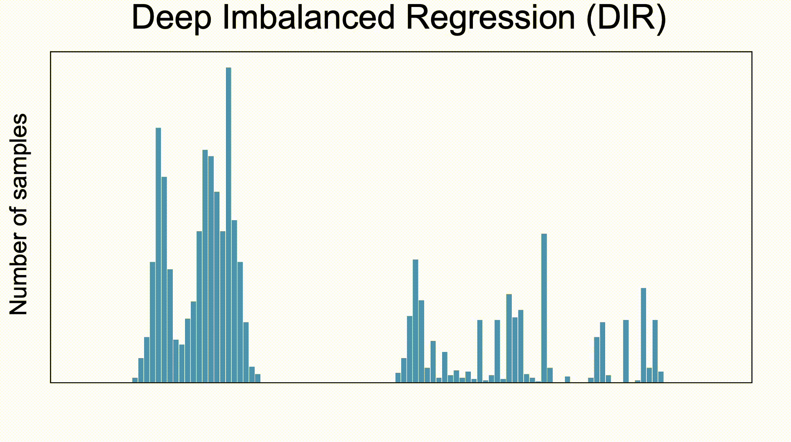

# Delving into Deep Imbalanced Regression

This repository contains the implementation code for paper: <br>
__[Delving into Deep Imbalanced Regression](https://arxiv.org/abs/2102.09554)__ <br>
Yuzhe Yang, Kaiwen Zha, Ying-Cong Chen, Hao Wang, and Dina Katabi <br>
_38th International Conference on Machine Learning (ICML 2021), **Long Talk**_ <br>
[Project Page] [[Paper](https://arxiv.org/abs/2102.09554)] [Video]

<p align="center">
     <br>
<b>Deep Imbalanced Regression (DIR)</b> aims to learn from imbalanced data with continuous targets, <br> tackle potential missing data for certain regions, and generalize to the entire target range.
</p>


## Beyond Imbalanced Classification: Brief Introduction for DIR
Existing techniques for learning from imbalanced data focus on targets with __categorical__ indices, i.e., the targets are different classes. However, many real-world tasks involve __continuous__ and even infinite target values. We systematically investigate _Deep Imbalanced Regression (DIR)_, which aims to learn continuous targets from natural imbalanced data, deal with potential missing data for certain target values, and generalize to the entire target range.

We curate and benchmark large-scale DIR datasets for common real-world tasks in _computer vision_, _natural language processing_, and _healthcare_ domains, ranging from single-value prediction such as age, text similarity score, health condition score, to dense-value prediction such as depth.


## Updates
- __[02/18/2021]__ [ArXiv version](https://arxiv.org/abs/2102.09554) posted. The code is currently under cleaning. Please stay tuned for updates.


## Citation
If you find this code or idea useful, please cite our work:
```bib
@article{yang2021delving,
  title={Delving into Deep Imbalanced Regression},
  author={Yang, Yuzhe and Zha, Kaiwen and Chen, Ying-Cong and Wang, Hao and Katabi, Dina},
  journal={arXiv preprint arXiv:2102.09554},
  year={2021}
}
```


## Contact
If you have any questions, feel free to contact us through email (yuzhe@mit.edu & kzha@mit.edu) or Github issues. Enjoy!
